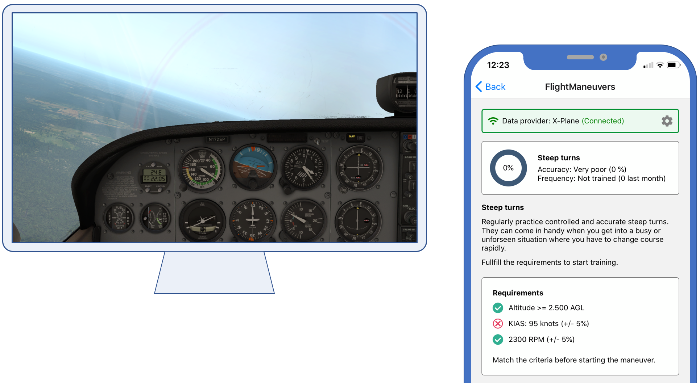

# flight-maneuvers
A React Native app that helps pilots train flight maneuvers. Those include steeps turns, stalls, emergency landings, and many more.

The goal is to support a variety of popular flight simulators. Potentially, the app could even analyze (real-time) actual flight recordings.

## Current status

The app is in **early** development.

Connection to the X-Plane simulator is working. Tested with the iOS app on iOS 13.3.1 and X-Plane v11.41. Receives altitude, engine RPM, and indicated airspeed. 

## Next steps

Get the steep turns maneuver fully working.

## Mid-term goals

- Implement a rich set of flight maneuvers
- Support additional simulators
- Provide rich performance analysis and comparison
- Conduct extensive user tests with pilots and non-pilots

## How it currently looks like

Shows the app set to the *steep turn* maneuver. Flight Maneuvers receives live data from X-Plane and updates the status of the maneuver requirements accordingly.

## Short demo video (Youtube)

